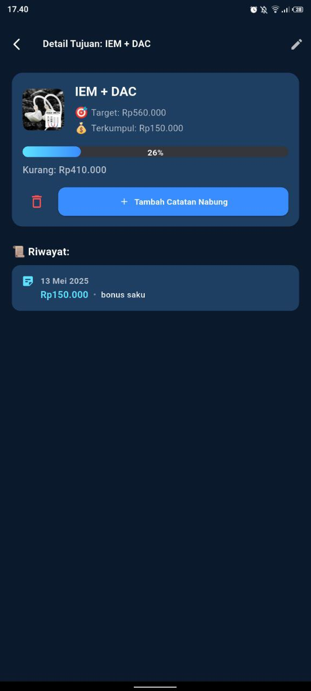

# 💰 DaKu (DanaKu) — Aplikasi Menabung Sederhana

**DaKu** adalah aplikasi Flutter sederhana yang membantu kamu membuat dan melacak tujuan tabungan pribadi dengan cara yang mudah dan menyenangkan.

---

## 📲 Fitur Utama

- 🎯 Tambah Target Tabungan (dengan nama, nominal, & gambar)
- ✍️ Tambah Catatan Nabung Harian (nominal + catatan opsional)
- 📊 Progress Bar untuk melihat kemajuan menabung
- 📅 Riwayat Nabung berdasarkan tanggal & jumlah
- 🗑️ Hapus atau reset target tabungan (opsional)
- 🌓 Dark Mode (belum ada light mode)
- 🔔 Notifikasi harian/mingguan (soon)
- 🎯 Multi-goal support (opsional)

---
## 📥 Download Aplikasi

[](https://github.com/hnxzl/DaKu/releases/download/release/app-release.apk)

🎉 Klik tombol di atas untuk langsung mengunduh aplikasi DaKu dan mulai menabung!

## 📱 Tampilan Aplikasi

| Beranda Utama | Logo Aplikasi |
|---------------|----------------|
|  |  |


## 📦 Cara Install

1. Clone repository ini:
   ```bash
   git clone https://github.com/hnxzl/DaKu.git
